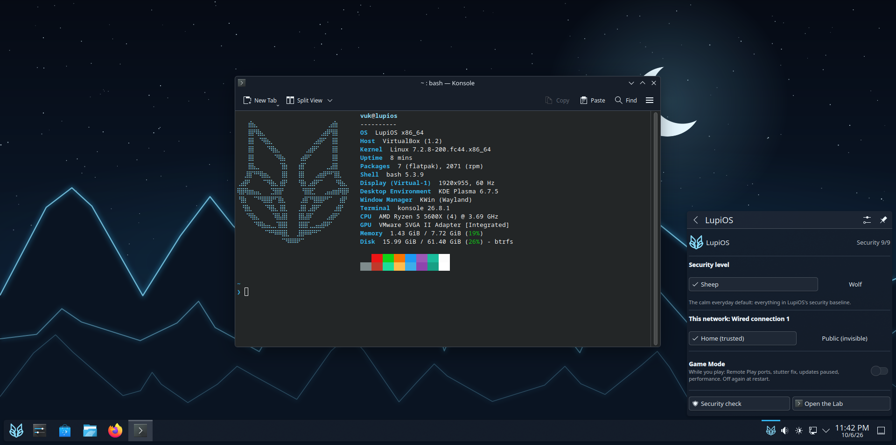

# LupiOS &nbsp; [](https://github.com/vukkz/lupios/actions/workflows/build.yml)

A hardened, rollback-safe everyday desktop with an isolated hacking lab.
Built on Fedora Atomic 44 (KDE Plasma) with [BlueBuild](https://blue-build.org).

**Website, downloads and guides: https://vukkz.github.io/lupios**



*Lupi* is Italian for "wolves": a pack. You control it all with the `lupi` command, and its two
security levels are **sheep** (calm, the everyday default) and **wolf** (maximum caution: alert,
on the hunt).

- **Secure by default, without the pain:** firewall blocks incoming traffic, hardened kernel settings, signed updates. Every setting and its trade-off is in [SECURITY.md](SECURITY.md).
- **Updates that can't brick you:** the whole system updates at once, and you can boot the previous version from the boot menu.
- **Lupi Lab:** Kali's top hacking tools in a container (`lupi lab`), not on your host system.
- **Networks that know who to trust:** new Wi-Fi networks are treated as public (invisible to other devices, random MAC address), and your home network as trusted. `lupi net` switches between them.
- **Gaming and security in one OS:** `lupi setup gaming` installs Steam, Heroic, Lutris and ProtonUp-Qt. `lupi game on` opens Remote Play ports, fixes stutter in some games and pauses updates while you play. `lupi level sheep|wolf` changes a whole bundle of protections at once.
- **One command for everything:** `lupi` (with tab completion). `lupi install discord` or `lupi install htop` picks the right way to install anything, and `lupi update` updates it all.
- **The wolf next to the clock:** click it to switch security level, network trust and Game Mode, and to see your security score.
- **LupiOS Welcome:** a first-login tour that sets up your security level, gaming and the Lab.

## The look

LupiOS ships defaults, not locks: change anything in System Settings and your choice wins.

- **Icy dark colours:** the "LupiOS" colour scheme (Breeze Dark with a navy tint and icy blue accent)
- **The wolf logo** (designed by vukkz, in ice-blue lines) on the app-menu button, the About page,
  the boot screen and the installer
- **Wallpapers:** LupiOS Night (default), LupiOS Lines (the same night, drawn in glowing lines like the
  logo) and LupiOS Emblem
- **No splash screen after login.** Turn one on in System Settings → Colors & Themes → Splash Screen.
- **Terminal:** every new terminal window opens with the wolf and your system info (`fastfetch`; `lupi fastfetch off` hides it), and an icy [starship](https://starship.rs) prompt (`lupi prompt off` turns it off)

The artwork is generated by [art/generate.mjs](art/generate.mjs), from the logo's outlines in
[art/logo/](art/logo/). After changing either, run `node art/generate.mjs` and open `art/preview.html`
to check the result.

## Pick your flavour

Both are the same LupiOS. The only difference is the graphics driver.

| Image | For |
|---|---|
| `ghcr.io/vukkz/lupios` | AMD or Intel graphics, and virtual machines |
| `ghcr.io/vukkz/lupios-nvidia` | NVIDIA graphics (GeForce/RTX). If Secure Boot is on, run `ujust enroll-secure-boot-key` after installing and reboot, or the NVIDIA driver isn't allowed to load |

In the commands below, use `lupios-nvidia` instead of `lupios` if you have NVIDIA.

## Installation

**New install from a USB stick:** follow [docs/install.md](docs/install.md). The installer ISOs are
built by the `build-iso` workflow (Actions tab → build-iso → Run workflow).

**Already running Fedora Atomic** (Silverblue, Kinoite and similar)? Switch it to LupiOS:

- First rebase to the unsigned image, to get the proper signing keys and policies installed:
  ```
  rpm-ostree rebase ostree-unverified-registry:ghcr.io/vukkz/lupios:latest
  ```
- Reboot to complete the rebase:
  ```
  systemctl reboot
  ```
- Then rebase to the signed image, like so:
  ```
  rpm-ostree rebase ostree-image-signed:docker://ghcr.io/vukkz/lupios:latest
  ```
- Reboot again to complete the installation
  ```
  systemctl reboot
  ```

The `latest` tag will automatically point to the latest build. That build will still always use the Fedora version specified in `recipe.yml`, so you won't get accidentally updated to the next major version.

## After installing

```bash
lupi check              # see what's protected (restart once after the "Kernel hardening added" message)
lupi lab                # enter the Lupi Lab (first time downloads a few GB)
lupi setup gaming       # optional: Steam, Heroic, Lutris, ProtonUp-Qt, MangoHud, gamescope
```

On first login, LupiOS Welcome walks you through the setup (open it again from the app menu: *Welcome Center*). Day to day, the wolf icon next to the clock or the `lupi` command does the rest:

```bash
lupi install discord    # apps come from Flathub, command-line tools from Arch Linux
lupi update             # system, apps and boxes; reboot afterwards if it says so
lupi net public         # on a network you don't trust (new Wi-Fi networks start as public)
lupi game on            # before playing; lupi game off afterwards
lupi level wolf         # maximum caution; sheep is the everyday default
lupi outgoing on        # apps ask before they connect to the internet (on in wolf)
```

Run `lupi help` to see every command.

## Update channels

| Channel | Image tag | Built from | For |
|---|---|---|---|
| **stable** | `latest` | the `main` branch, plus a daily rebuild for Fedora security updates | everyone |
| **testing** | `br-testing-44` | the `testing` branch | trying new changes in a VM first |

Switch with `lupi channel stable` or `lupi channel testing`, then reboot.

**How changes ship:**
1. New work is pushed to the `testing` branch.
2. Try it on a testing machine: `lupi update`, reboot, test.
3. If it works, promote it: `git push origin testing:main`. Stable machines get it with their next update.

## Verification

These images are signed with [Sigstore](https://www.sigstore.dev/)'s [cosign](https://github.com/sigstore/cosign). You can verify the signature by downloading the `cosign.pub` file from this repo and running the following command:

```bash
cosign verify --key cosign.pub ghcr.io/vukkz/lupios
```
